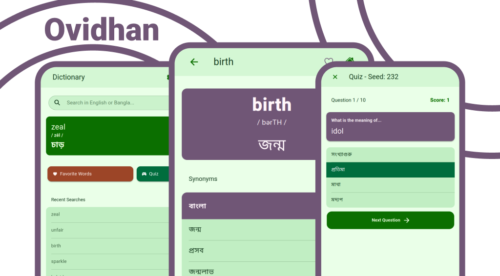

# Ovidhan: English-Bangla Dictionary



Ovidhan is a modern, feature-rich, and offline-first English to Bangla dictionary **with no ads and tracking** application built with the Ionic Framework and Vue.js. It is designed to be fast, efficient, and user-friendly.

## Features

  * **Dual Language Search**: Instantly search for words in either English or Bangla. No more switching of button for searching.
  * **Word of the Day**: A new word is automatically selected each day. You can opt-in to get notification of it everyday.
  * **Comprehensive Word Details**: View detailed information for each word, including pronunciation, parts of speech, synonyms, and antonyms in both languages.
  * **Quiz**: Test your vocabulary.
  * **Persistent User Data**:
      * **Favorites**: Save words for future reference.
      * **Recent Searches**: Quickly access your search history.
  * **Customizable User Experience**:
      * **Dark & Light Mode**: Automatic and manual theme switching.
      * **Adjustable Text Size**: Change the font size for improved readability.
      * **UI Language Switching**: Toggle the app's interface between English and Bangla.

**And many more are coming** (probably)

## Tech Stack

  * **Framework**: Ionic with Vue.js
  * **Language**: TypeScript
  * **Native Runtime**: Capacitor
  * **Package Manager**: pnpm
  * **CI/CD**: GitHub Actions for automated Android builds and releases.

# If you want to build the app yourself, or want to contribute..

## Project Setup

### Prerequisites

  * Node.js (v20 or later recommended)
  * pnpm
  * A Java Development Kit (JDK) for Android builds (v21)

### Installation

1.  **Clone the repository:**

    ```
    git clone https://github.com/doomkey/ovidhan
    cd ovidhan
    ```

2.  **Install dependencies:**

    ```
    pnpm install
    ```

3.  **Run for development:**
    This will start a local development server with hot-reloading.

    ```
    ionic serve
    ```

For any other details, please refer to official Ionic and Vue docs.

## Data Processing Scripts

This project uses several build-time scripts to process the dictionary data for optimal performance. 

**Important:** You only need to run these scripts if you make changes to the source `BengaliDictionary-*.json` files in `src/resources/`. You may not run these though. BUt the instructions are here for clarification.

1.  **`process-dictionary.js`**:

      * **What it does**: Reads all source dictionary files, lowercases all English keys, merges any duplicate entries, cleans Bangla synonym/antonym lists by removing any English characters, and re-splits the cleaned data back into the `src/resources/` directory.
      * **When to run**: Run this script first if you have modified the raw dictionary data.
      * **Command**: `node src/scripts/process-dictionary.js`

2.  **`generate-bangla-index.js`**:

      * **What it does**: Creates a highly optimized, minified `src/generated/bangla-index.json` file. This file maps every Bangla word to the location of its primary English entry, for fast Bangla searches.
      * **When to run**: Run this after `process-dictionary.js`.
      * **Command**: `node src/scripts/generate-bangla-index.js`

3.  **`generate-word-of-the-day-candidates.js`**:

      * **What it does**: Creates a minified `src/generated/wordOfTheDayCandidates.json` file containing a list of all words that meet the criteria for "Word of the Day" (e.g., having at least 3 synonyms).
      * **When to run**: Run this after `process-dictionary.js`.
      * **Command**: `node src/scripts/generate-word-of-the-day-candidates.js`

## Building for Native Platforms

1.  **Sync web assets with the native project:**

    ```
    pnpm exec capacitor sync android
    ```

2.  **Open the native project in Android Studio:**

    ```
    pnpm exec capacitor open android
    ```

3.  From Android Studio, you can build, run, and debug the app on an emulator or a physical device. If you dont want to use Android Studio, just use Gradle to build it.


# Word data

`BengaliDictionary-*.json` files in `src/resources/` contain all the words. If you want to use the words file, please credit https://github.com/MinhasKamal/BengaliDictionary 

If want to add/update any word, go to the corresponding file,
for example to add the word `dumb` go to `src/resources/BengaliDictionary-d.json`. Then run `node src/scripts/process-dictionary.js`